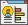
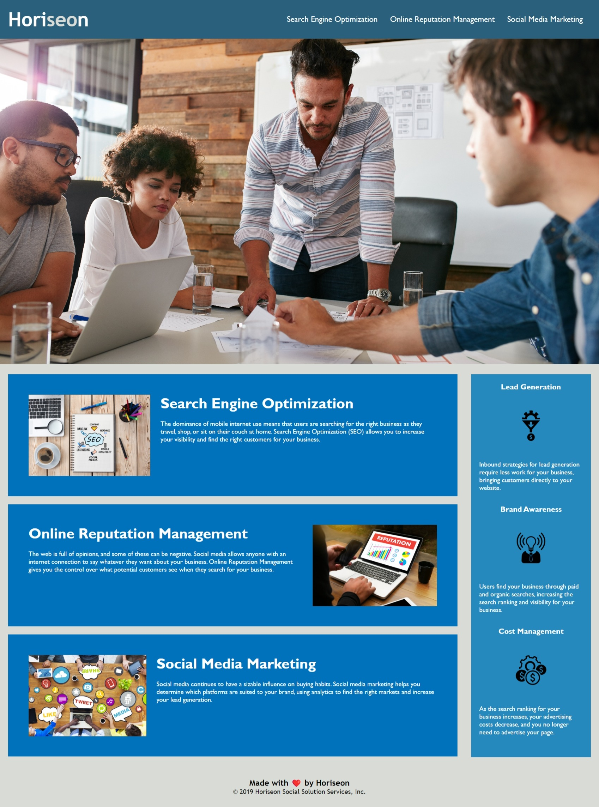

<!-- Improved compatibility of back to top link: See: https://github.com/othneildrew/Best-README-Template/pull/73 -->

<!--
*** Thanks for checking out the Best-README-Template. If you have a suggestion
*** that would make this better, please fork the repo and create a pull request
*** or simply open an issue with the tag "enhancement".
*** Don't forget to give the project a star!
*** Thanks again! Now go create something AMAZING! :D
-->

<!-- PROJECT SHIELDS -->
<!--
*** I'm using markdown "reference style" links for readability.
*** Reference links are enclosed in brackets [ ] instead of parentheses ( ).
*** See the bottom of this document for the declaration of the reference variables
*** for contributors-url, forks-url, etc. This is an optional, concise syntax you may use.
*** https://www.markdownguide.org/basic-syntax/#reference-style-links
-->

[![Contributors][contributors-shield]][contributors-url]
[![Forks][forks-shield]][forks-url]
[![Stargazers][stars-shield]][stars-url]
[![Issues][issues-shield]][issues-url]
[![MIT License][license-shield]][license-url]
[![Followers][followers-shield]][followers-url]

<!-- PROJECT LOGO -->

 

  

<h3 align="center">Online Marketing and Advertising</h3>

  

    This projectsd was created for students who are currently doing the Coding Boot Camp offered by UNB. It contains the assignment found in Module 1 Challenge.
      
    <a href="https://github.com/Mathieu-Despres/HTML-CSS-code-refactor"><strong>Explore the docs »</strong></a>
     
     
    <a href="https://mathieu-despres.github.io/HTML-CSS-code-refactor/">View Demo</a>
    ·
    <a href="https://github.com/Mathieu-Despres/HTML-CSS-code-refactor/issues">Report Bug</a>
    ·
    <a href="https://github.com/Mathieu-Despres/HTML-CSS-code-refactor/issues">Request Feature</a>
  

<!-- TABLE OF CONTENTS -->

      
<b>Table of Contents</b>

    <ol> 
      <li><a href="#about-the-project">About The Project</a></li>
      <li><a href="#built-with">Built With</a></li>
      <li><a href="#installation">Installation</a></li>
      <li><a href="#usage">Usage</a></li>
      <li><a href="#roadmap">How to Complete the Challenge</a></li>
      <li><a href="#contributing">Contributing</a></li>
      <li><a href="#license">License</a></li>
      <li><a href="#acknowledgments">Acknowledgments</a></li>
      <li><a href="#contact">Contact</a></li>
    </ol>

  

<!-- ABOUT THE PROJECT -->

## About The Project

 

  
  
 

<b>** COPIED FROM THE UNB'S CHALLENGE (COURSE #2326 | ASSIGNMENT #42481) FOUND INSIDE THE BOOTCAMP SPOT WEBSITE **</b>

<i><h3>HTML CSS Git Challenge: Code Refactor</h3>
This week is an odd-numbered week, so your Challenge is an on-the-job ticket, which means you'll begin with starter code that you need to modify. This week's challenge involves a very important aspect of web development: accessibility.

One of the most common tasks for front-end and junior developers is to take existing code and refactor it (recall that to refactor code is to improve it without changing what it does) to meet a certain set of standards or implement a new technology. In this Challenge, a marketing agency has hired you to refactor an existing site to make it more accessible.

NOTE
Your coursework this week will prepare you with all the skills that you need to succeed on this assignment!

Web accessibility is an increasingly important consideration for businesses. It ensures that people with disabilities can access a website using assistive technologies such as video captions, screen readers, and braille keyboards. Making a website accessible is also good for business for many reasons, one of them being that accessible sites are better positioned in search engines like Google. It also helps companies avoid litigation that can occur when people with disabilities can't access their website.

Even though accessibility is a broad topic that can include complex requirements, your tech lead has given you a small list of specific criteria to satisfy the project. These criteria are documented in the Acceptance Criteria section.

IMPORTANT
An important rule to follow when working with someone else's code is the Scout Rule, which recommends that you always leave the code a little cleaner than when you found it.

To impress clients, you should always go the extra mile and improve the codebase for long-term sustainability. For example, make sure that all links are functioning correctly. Also, rework the CSS to make it more efficient by consolidating CSS selectors and properties, organizing them to follow the semantic structure of the HTML elements, and including comments before each element or section of the page.</i>

(<a href="#readme-top">back to top</a>)

<!-- FRAMEWORKS AND/OR LIBRARIES USED -->

## Built With  

* [![HTML][HTML.com]][HTML-url]
* [![CSS][Css.com]][Css-url]

(<a href="#readme-top">back to top</a>)

<!-- GETTING STARTED -->

## Installation

N/A

(<a href="#readme-top">back to top</a>)

<!-- USAGE EXAMPLES -->

## Usage

This is only a repository for students studying the Coding Boot Camp provided by UNB.

(<a href="#readme-top">back to top</a>)

<!-- COMPLETE THE CHALLENGE -->

## How to Complete the Challenge

Follow these steps to complete the challenge:

1. Clone your starter codeLinks to an external site..

2. Refactor the code to meet the Acceptance Criteria.

3. Make sure your work meets the full list of grading requirements.

4. Follow the instructions to submit your Challenge for review.

 

<b>IMPORTANT</b> Make sure to clone the starter code repository and make your own repository with the starter code. Do not fork the starter code repository!
 

Also, see the [open issues](https://github.com/Mathieu-Despres/courses-challenge-module-1/issues) for a full list of proposed features (and known issues).

(<a href="#readme-top">back to top</a>)

<!-- CONTRIBUTING -->

## Contributing

If you have a suggestion that would make this better, please fork the repo and create a pull request. You can also simply open an issue with the tag "enhancement".
Don't forget to give the project a star! Thanks again!

1. Fork the Project
2. Create your Feature Branch (`git checkout -b feature/YourFeature`)
3. Commit your Changes (`git commit -m 'Add some YourFeature'`)
4. Push to the Branch (`git push origin feature/YourFeature`)
5. Open a Pull Request

(<a href="#readme-top">back to top</a>)

<!-- LICENSE -->

## License

Distributed under the MIT License. See "LICENSE.txt" for more information.

(<a href="#readme-top">back to top</a>)

<!-- ACKNOWLEDGMENTS -->

## Acknowledgments

[&#10004;]&nbsp;The [Best-README-Template](https://github.com/othneildrew/Best-README-Template) used as a starter template for this [README file](https://github.com/Mathieu-Despres/courses-challenge-module-1/blob/main/README.md) 
[&#10004;]&nbsp;The [repository](https://github.com/coding-boot-camp/urban-octo-telegram) used as the starter code for this challenge 
[&#10004;]&nbsp;The [W3Schools](https://www.w3schools.com/) for their freemium educational website for application-related implementation options and examples, along with helpful references 

(<a href="#readme-top">back to top</a>)

<!-- CONTACT -->

## Contact

Mathieu Despres: [@GitHub](https://github.com/Mathieu-Despres) - mathieudespres@outlook.com

Project Link: [https://github.com/Mathieu-Despres/courses-challenge-module-1](https://github.com/Mathieu-Despres/courses-challenge-module-1)

(<a href="#readme-top">back to top</a>)

<!-- MARKDOWN LINKS & IMAGES -->

<!-- https://www.markdownguide.org/basic-syntax/#reference-style-links -->
[contributors-shield]: https://img.shields.io/github/contributors/Mathieu-Despres/courses-challenge-module-1?color=Green&style=for-the-badge
[contributors-url]: https://github.com/Mathieu-Despres/courses-challenge-module-1/graphs/contributors
[forks-shield]: https://img.shields.io/github/forks/Mathieu-Despres/courses-challenge-module-1?style=for-the-badge
[forks-url]: https://github.com/Mathieu-Despres/courses-challenge-module-1/network/members
[stars-shield]: https://img.shields.io/github/stars/Mathieu-Despres/courses-challenge-module-1?color=Green&style=for-the-badge
[stars-url]: https://github.com/Mathieu-Despres/courses-challenge-module-1/stargazers
[issues-shield]: https://img.shields.io/github/issues/Mathieu-Despres/courses-challenge-module-1.svg?style=for-the-badge
[issues-url]: https://github.com/Mathieu-Despres/courses-challenge-module-1/issues
[license-shield]: https://img.shields.io/github/license/Mathieu-Despres/courses-challenge-module-1.svg?style=for-the-badge
[license-url]: https://github.com/Mathieu-Despres/courses-challenge-module-1/blob/main/LICENSE
[followers-shield]: https://img.shields.io/github/followers/Mathieu-Despres?style=for-the-badge
[followers-url]: https://linkedin.com/in/linkedin_username
[product-screenshot]: ./assets/images/screenshot.jpeg
[Next.js]: https://img.shields.io/badge/next.js-000000?style=for-the-badge&logo=nextdotjs&logoColor=white
[Next-url]: https://nextjs.org/
[React.js]: https://img.shields.io/badge/React-20232A?style=for-the-badge&logo=react&logoColor=61DAFB
[React-url]: https://reactjs.org/
[Vue.js]: https://img.shields.io/badge/Vue.js-35495E?style=for-the-badge&logo=vuedotjs&logoColor=4FC08D
[Vue-url]: https://vuejs.org/
[Angular.io]: https://img.shields.io/badge/Angular-DD0031?style=for-the-badge&logo=angular&logoColor=white
[Angular-url]: https://angular.io/
[Svelte.dev]: https://img.shields.io/badge/Svelte-4A4A55?style=for-the-badge&logo=svelte&logoColor=FF3E00
[Svelte-url]: https://svelte.dev/
[Laravel.com]: https://img.shields.io/badge/Laravel-FF2D20?style=for-the-badge&logo=laravel&logoColor=white
[Laravel-url]: https://laravel.com
[Bootstrap.com]: https://img.shields.io/badge/Bootstrap-563D7C?style=for-the-badge&logo=bootstrap&logoColor=white
[Bootstrap-url]: https://getbootstrap.com
[JQuery.com]: https://img.shields.io/badge/jQuery-0769AD?style=for-the-badge&logo=jquery&logoColor=white
[JQuery-url]: https://jquery.com 
[CSS.com]: https://raw.githubusercontent.com/Mathieu-Despres/courses-challenge-module-1/fb01f6d47c8a56871d880d512e10b5e5ae676ca5/images/CSS-Cascading%20Style%20Sheets-blue.svg
[CSS-url]: https://www.w3schools.com/css/default.asp
[HTML.com]: https://raw.githubusercontent.com/Mathieu-Despres/courses-challenge-module-1/fb01f6d47c8a56871d880d512e10b5e5ae676ca5/images/HTML-HyperText%20Markup%20Language-orange.svg
[HTML-url]: https://www.w3schools.com/html/default.asp